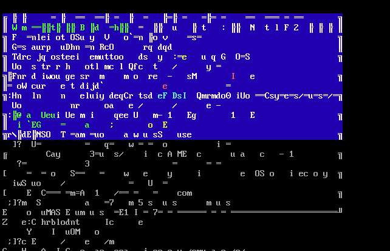

<html>
  <head>
    <h1>eJPT Malware Exercise</h1>
    
  </head>
  
  <body>
    <h2>Purpose</h2>
    
I created this repo as a place for all malware that I will be writing during the Penetration Testing Student course at INE.

    <h2>C/C++</h2>
    
The C++ malware in this repo is a simple keylogger and directory reader. This malware includes topics such as:

    <ul>
      <li>TCP/IP Network Sockets (Client)</li>
      <li>Copying the directories and contents of those infected</li>
      <li>Keylogging</li>
    </ul>
  </body>

</html>
